# Mira — Screenshot Reference

Evidence for the Q2 submission: workflow canvas, Mira in action, and observability traces. All captured from the final working build (n8n self-hosted, `gpt-4o-mini`, Langfuse US Cloud).

## 1. Workflow canvas

**`01_router_canvas.png`** — The full Router workflow: Manual Trigger → Edit Fields (request + file manifest) → Basic LLM Chain (temperature 0 classifier) → Code node (JSON parse) → Switch (4 rules + Fallback) → four Execute Sub-workflow nodes (Planner, Risk Assessor, Status Reporter, Milestone Tracker). The branch across the top is the Langfuse tracing path (Code node builds the payload, HTTP Request posts it). This run took the Fallback path.

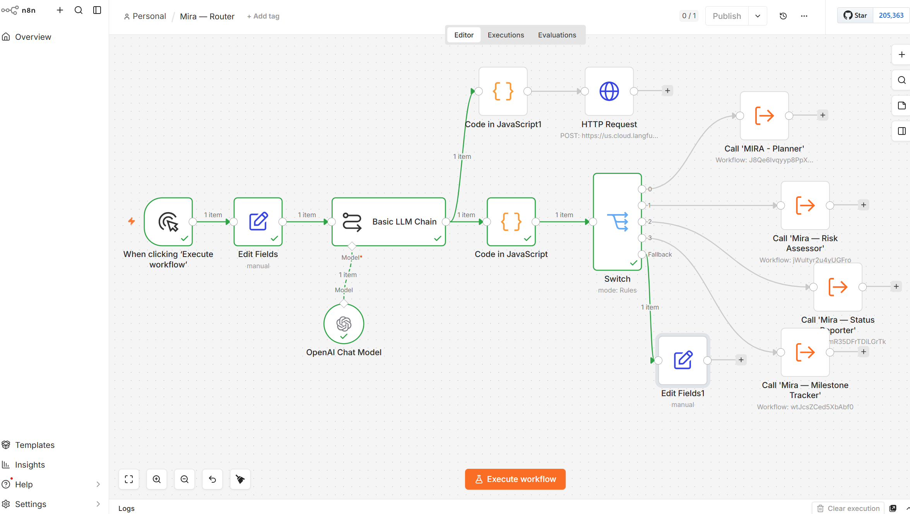

## 2. Mira in action

### Plan request routed to the Planner

**`02_router_in_action_plan.png`** — Router input shows `intent: PLAN`, `target_agent: planner`. The Planner sub-workflow ran and returned `201` from Langfuse for both the trace and generation.

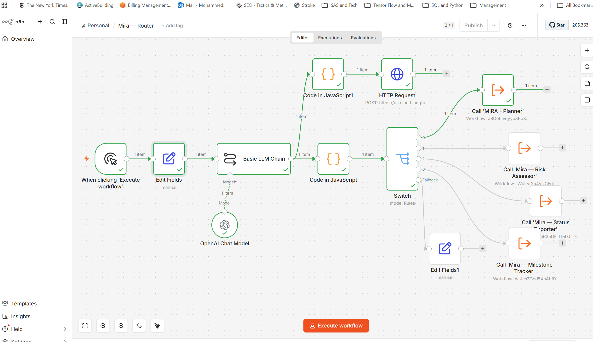

**`02b_planner_output.png`** — The Planner's own execution: all 8 phases from `project_timeline.csv` (correct week ranges, each with a source citation), the three stated goals, `Duration: Not stated`, `Assumptions: None`.

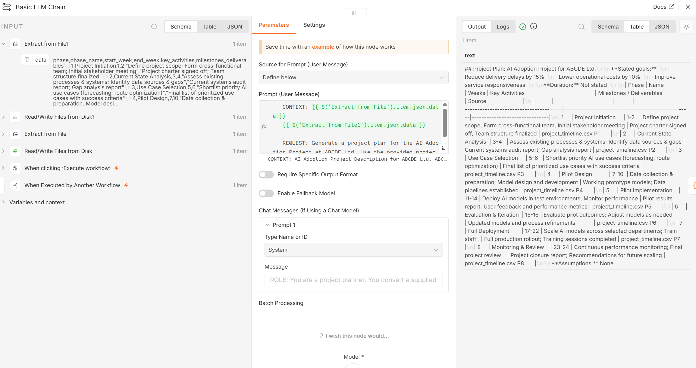

### Request with no valid intent refused by the Router

**`03a_router_refusal_canvas.png`** — "What's the weather like today?" takes the Fallback branch; all four specialist nodes stay inactive.

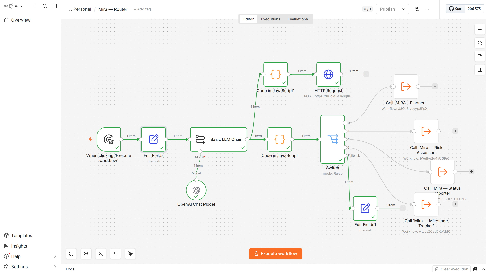

**`03b_refusal_output.png`** — Input shows the Router's decision (`intent: INSUFFICIENT`, `target_agent: none`, `missing: project name or data`); output is the refusal message. No generating agent ran.

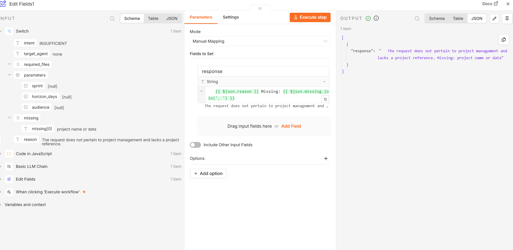

**`03c_router_classification.png`** — The classification result for the same run.

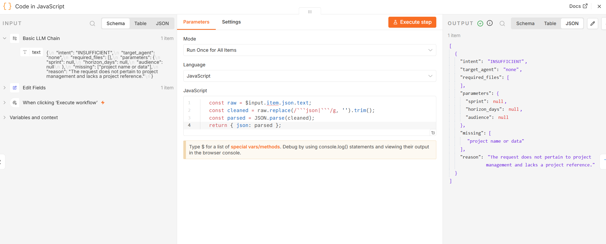

### Status request routed to the Status Reporter

**`04a_router_status_canvas.png`** — "Give me a status report for the project" routes through Switch output 2.

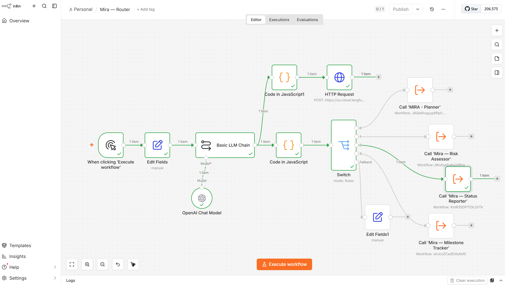

**`04b_status_report_output.png`** — Counts `Done 5 · In Progress 3 · To Do 16 · Blocked 1 · Total 25` (computed in the Data Prep Code node, not the LLM), T024 listed as Blocked with its reason, T006 overdue by 1 day, Health Red. Matches ground truth exactly.

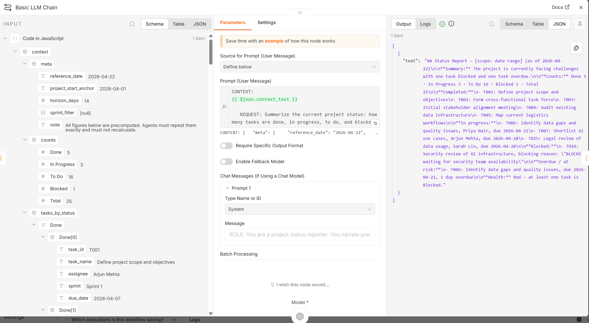

### Risk and milestone requests

**`05a_router_risk_canvas.png`** — Risk assessment request routed through Switch output 1 to the Risk Assessor.

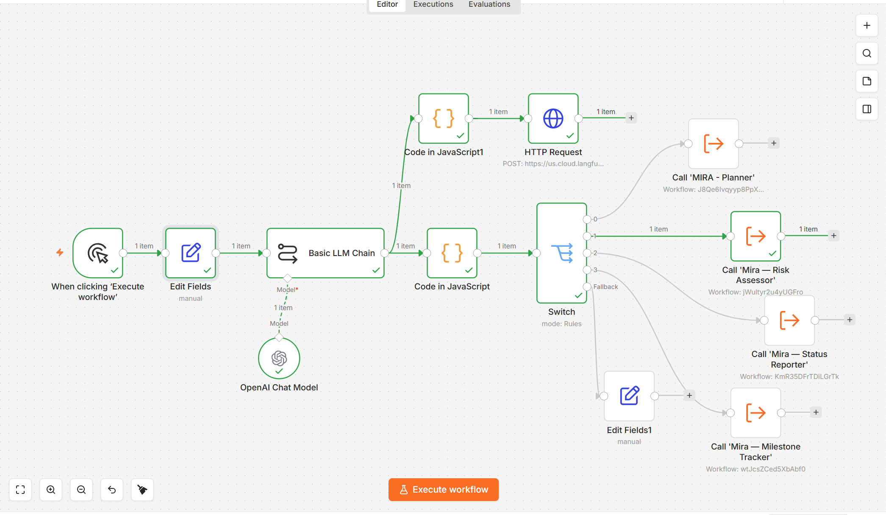

**`05b_router_milestone_canvas.png`** — Milestone request routed through Switch output 3 to the Milestone Tracker.

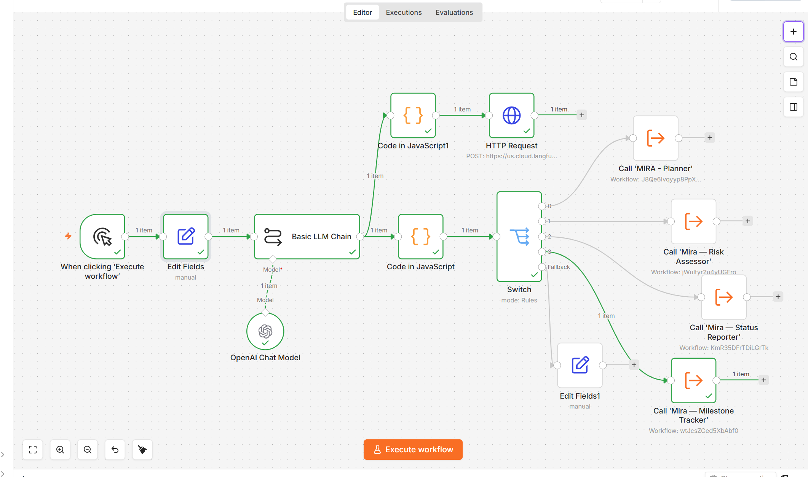

## 3. Observability (Langfuse)

**`05_langfuse_traces_list.png`** — Traces from all five components (Router classification plus the four specialists). The Output column shows each Router decision, e.g. `RISK` → `risk_assessor`, `MILESTONE` → `milestone_tracker`, `INSUFFICIENT` → `none`.

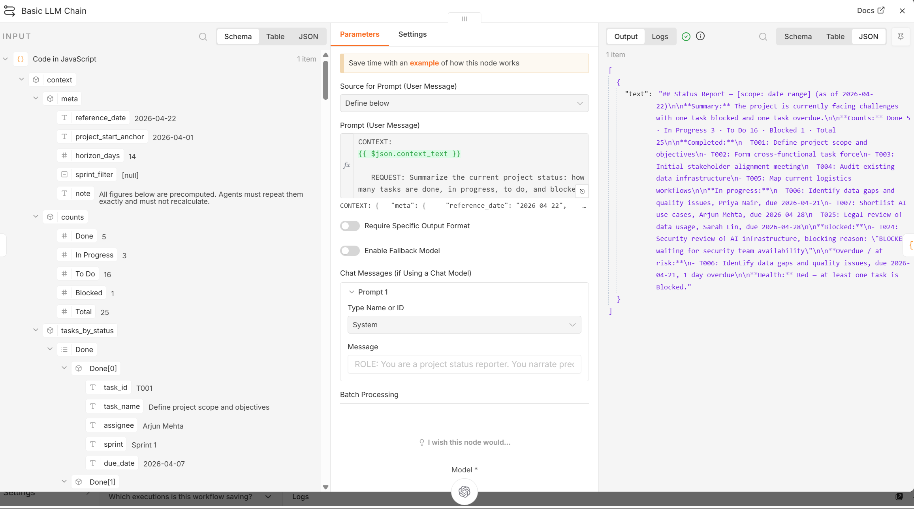

**`06_langfuse_trace_detail.png`** — One Status Reporter trace opened: the trace span with its `status-reporter-llm-call` generation, the input, and the full formatted report.

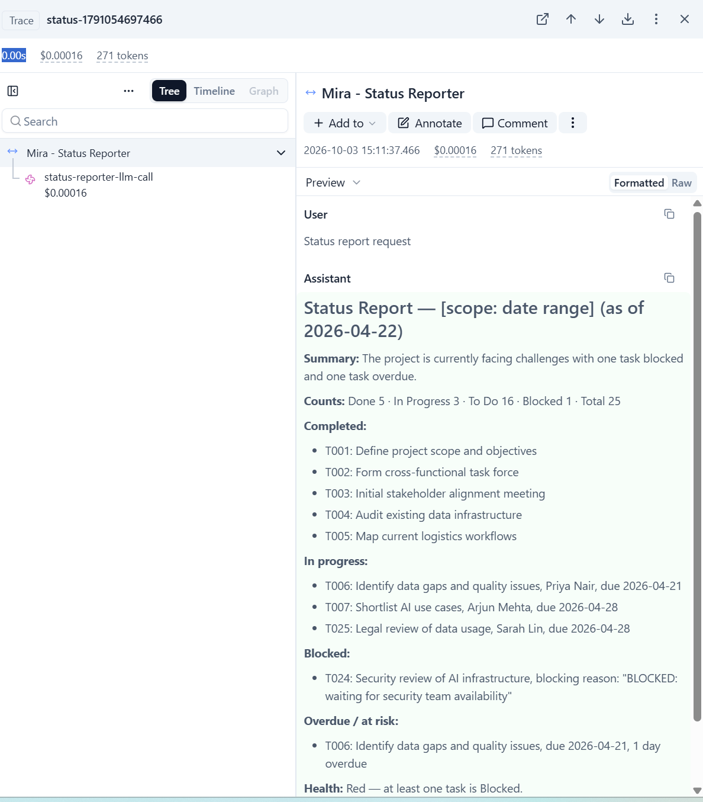

## Known limitations visible in these screenshots

- **Cost and tokens in Langfuse understate the real figures.** The tracing node sends a short placeholder as the input and only the real output text, so Langfuse's $0.00016 / 271 tokens reflects the output only. The real prompt for this run was about 2,577 tokens, which puts the true cost near $0.00056 (see the cost analysis in the architecture writeup). Fix for v2: pass actual token usage in the generation event.
- **Latency reads 0.00s.** The tracing code sets `startTime` and `endTime` to the same timestamp, so per-agent latency is not measured. Fix for v2: capture timestamps before and after the LLM call.
- **"We want to build a chatbot." routes to the Planner, not the Fallback.** The Router classifies it as a plan request, which is a defensible reading, since the project files are loaded. The vague-input refusals (T2, T9) were validated against the Planner on its own; through the Router, only requests with no valid intent are refused (see `03a`/`03b`).
- **Sub-workflow output.** The Execute Sub-workflow node hands back the last node's output, which is now the Langfuse HTTP response rather than the generated report (visible in `02_router_in_action_plan.png`). The report itself is visible in the specialist's own execution (`02b`, `04b`). Fix for v2: make the tracing node a side branch.
